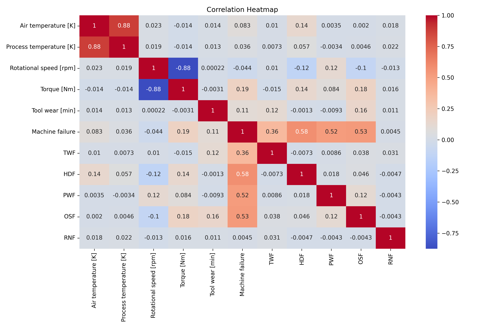
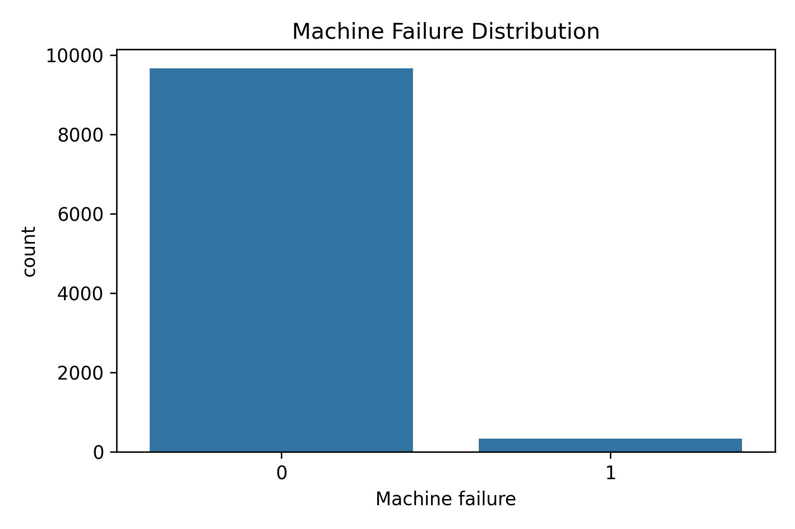
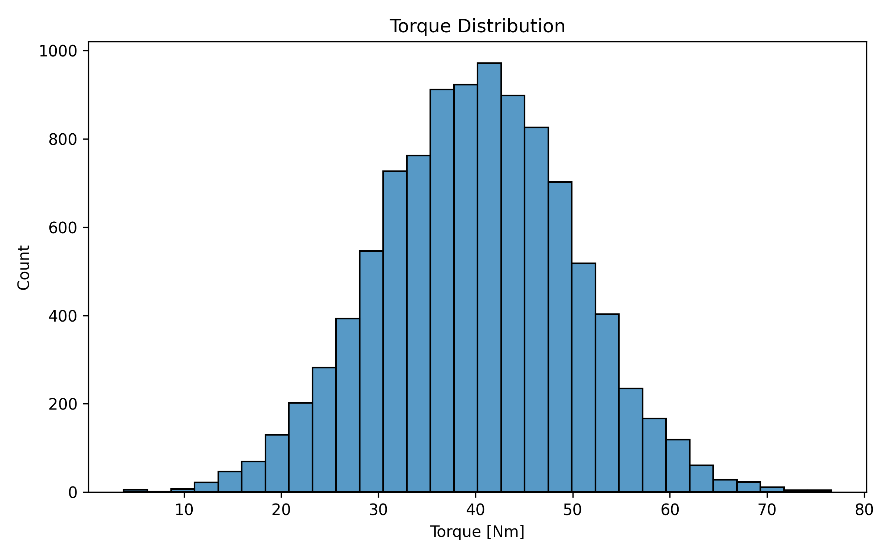

# Predictive Maintenance Analysis using AI4I 2020 Dataset

## 📌 Project Overview

This project performs **Data Cleaning** and **Exploratory Data Analysis (EDA)** on the **AI4I 2020 Predictive Maintenance Dataset**. The goal is to understand the dataset, identify important patterns, prepare the data for machine learning, and build predictive maintenance models in the next phase.

---

## 📂 Project Structure

```
Predictive-Maintenance-Analysis/
│
├── data/
│   ├── raw/
│   │   └── ai4i2020.csv
│   └── processed/
│       └── ai4i2020_processed.csv
│
├── notebooks/
│   └── 01_Data_Cleaning_and_EDA.ipynb
│
├── images/
│
├── README.md
├── requirements.txt
├── .gitignore
└── LICENSE
```

---

## 📊 Dataset

The project uses the **AI4I 2020 Predictive Maintenance Dataset**, which contains **10,000 machine observations** with operational sensor readings and failure information.

### Features

- Air Temperature [K]
- Process Temperature [K]
- Rotational Speed [rpm]
- Torque [Nm]
- Tool Wear [min]
- Machine Type

### Target Variables

- Machine Failure
- Tool Wear Failure (TWF)
- Heat Dissipation Failure (HDF)
- Power Failure (PWF)
- Overstrain Failure (OSF)
- Random Failure (RNF)

---

## 🧹 Data Cleaning

The following preprocessing steps were completed:

- Removed unnecessary identifier columns (`UDI`, `Product ID`)
- Checked for missing values
- Verified duplicate records
- Encoded the `Type` categorical feature
- Created a new **Failure Type** column based on failure indicators

---

## 📈 Exploratory Data Analysis (EDA)

The analysis includes:

- Dataset overview
- Statistical summary
- Missing value analysis
- Machine failure distribution
- Failure type distribution
- Correlation analysis
- Feature relationship visualization

---

## 🔍 Key Findings

- Dataset contains **10,000 machine records**
- Machine failure is highly imbalanced:
  - No Failure: **96.61%**
  - Failure: **3.39%**
- Strong positive correlation between:
  - Air Temperature and Process Temperature
- Strong negative correlation between:
  - Rotational Speed and Torque

---

## 🛠️ Technologies Used

- Python
- Pandas
- NumPy
- Matplotlib
- Seaborn
- Jupyter Notebook

---

## 🚀 Future Work

The next phase of the project will include:

- Data Preprocessing
- Feature Scaling
- Train-Test Split
- Machine Failure Prediction
- Failure Type Classification
- TensorFlow Neural Network
- Model Evaluation
- Model Comparison
- Model Deployment

---

## Correlation Heatmap



## Machine Failure Distribution



## Feature Distribution



## 📌 How to Run

1. Clone the repository:

```bash
git clone https://github.com/<your-username>/Predictive-Maintenance-Analysis.git
```

2. Navigate to the project directory:

```bash
cd Predictive-Maintenance-Analysis
```

3. Install the required packages:

```bash
pip install -r requirements.txt
```

4. Open the notebook:

```
notebooks/01_Data_Cleaning_and_EDA.ipynb
```

---

## 📄 License

This project is licensed under the MIT License.